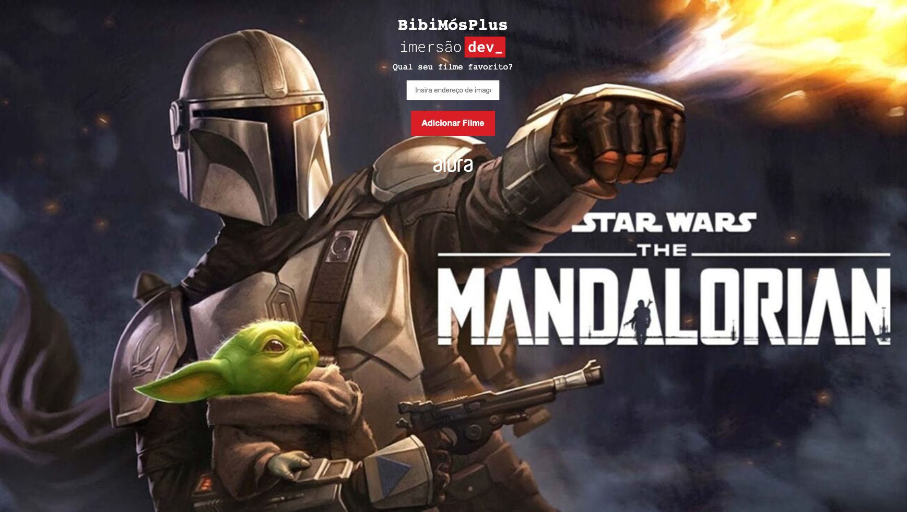
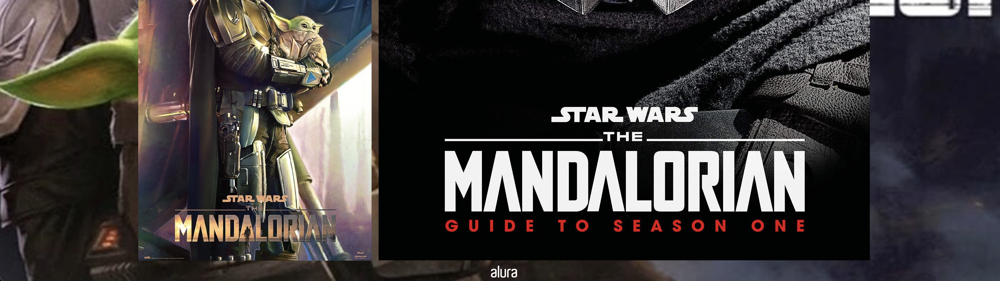

# 📝 Bibi Flix II - Funções
### 🤓 Bibi's Flix II - Functions
 

📸 Screenshot

#  🚀 Technologies

- [HTML](##HTML)
- [CSS](##CSS)
- [JavaScript](##JavaScript)
- [Github](##github)
- [Codepen](##codepen)
- [VScode](##vscode)

# 🔭 Objective of mission Function:

In the input field: "Insert image address", paste the address of the desired image to render on the page, for example [add this image address in the field:](https://m.media-amazon.com/images/I/91PBVBTyRGL.jpg) or [this image address:](https://cdn.europosters.eu/image/1300/posters/star-wars-the-mandalorian-clan-of-two-i101934.jpg)

   ⚙️ or just copy and paste any of these links (one at a time):
   - https://m.media-amazon.com/images/I/91PBVBTyRGL.jpg

   - https://cdn.europosters.eu/image/1300/posters/star-wars-the-mandalorian-clan-of-two-i101934.jpg

   🛠 After pasting the image address link, click on the red notation written: "Add Movie" and that's it, the images are rendered on the screen, as in these screenshots:
 
 
  # 🔭 PT-BR: Objetivo da missão Funções: 

  No campo de digitação: "Insira endereço de imagem", colar o endereço da imagem desejada para renderizar na página, por exemplo, [adicionar este endereço de imagem no campo:](https://m.media-amazon.com/images/I/91PBVBTyRGL.jpg) ou [este endereço de imagem:](https://cdn.europosters.eu/image/1300/posters/star-wars-the-mandalorian-clan-of-two-i101934.jpg)

  ⚙️ ou apenas copie e cole algum destes links (um por vez): 
  - https://m.media-amazon.com/images/I/91PBVBTyRGL.jpg 

  - https://cdn.europosters.eu/image/1300/posters/star-wars-the-mandalorian-clan-of-two-i101934.jpg 

  🛠 Após colar o link do endereço da imagem, clicar no notão de cor vermelha escrito: "Adicionar Filme" e pronto, as imagens são renderizadas na tela, como nestas capturas de telas:

  📸 Screenshot
  
  
  
  
  
  

# 👩🏻‍💻 Project
Project made in immersion dev_ Alura's course of development for beginner

➰〰️

PT-BR: Projeto feito em curso imersão dev_ curso de desenvolvimento para iniciante da Alura

 #
 
                        Feito com 🤍 by BM

 #### 🔎 **[Online project here](https://codepen.io/biancamos/full/MWJjQEw)** Projeto desenvolvido em Agosto de 2022. 